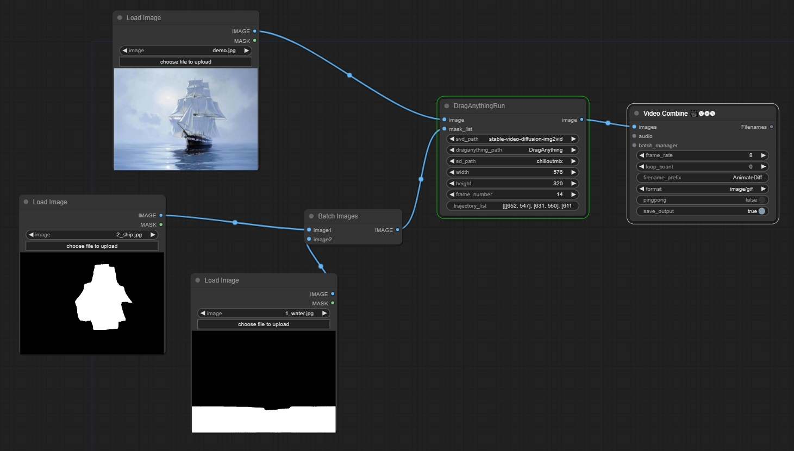
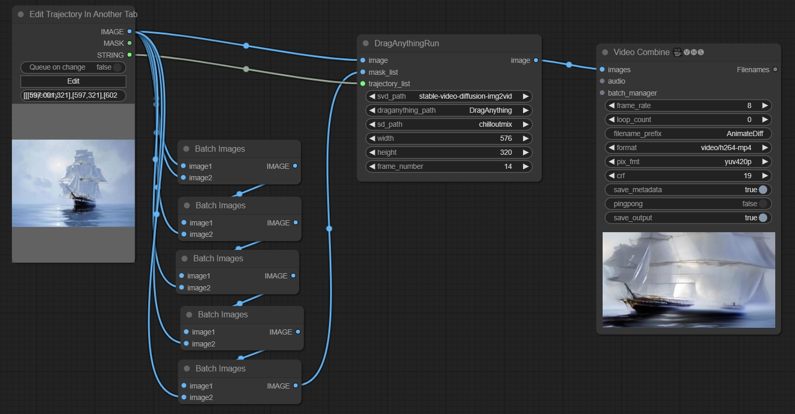
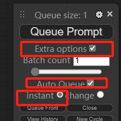
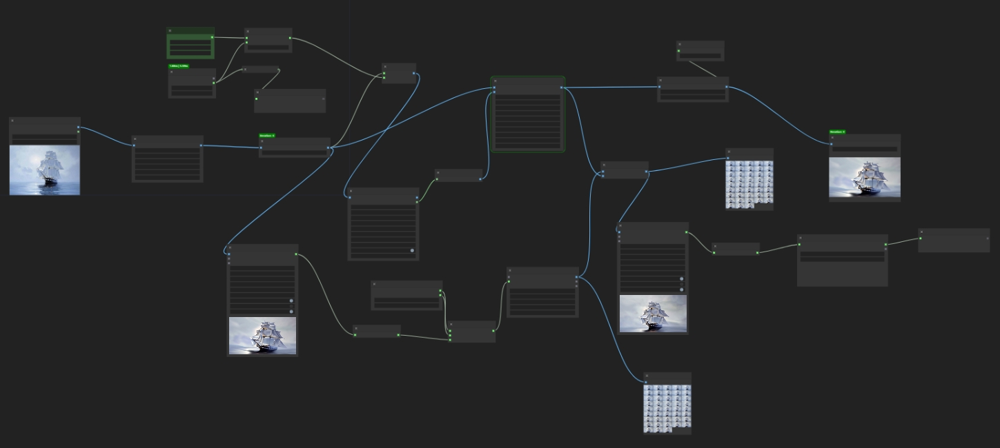
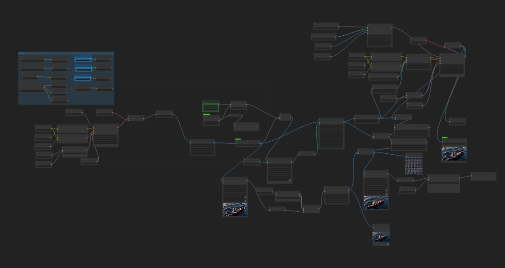

ComfyUI DragAnything

## Notice

mask_list length needs to be greater than or equal to trajectory_list length

trajectory_list length needs to be greater than or equal to frame_number

height and width must be multiples of 64

## Install

```
pip install -r requirements.txt

cd custom_nodes/ComfyUI-DragAnything/pretrained_models

git-lfs clone https://huggingface.co/windwhinny/chilloutmix.git
git-lfs clone https://huggingface.co/weijiawu/DragAnything
git-lfs clone https://huggingface.co/stabilityai/stable-video-diffusion-img2vid
```

注意，如果不执行pip install -r requirements.txt进行安装，一定要执行pip install diffusers==0.19.3安装这个版本的diffusers

## Basic workflow



https://github.com/chaojie/ComfyUI-DragAnything/blob/main/workflow.json

## With ComfyUI-Trajectory

```
cd custom_nodes
git clone https://github.com/chaojie/ComfyUI-Trajectory.git
```



https://github.com/chaojie/ComfyUI-DragAnything/blob/main/workflow_traj.json

## Cyclist workflow 无限长度视频生成

修改Max Time节点int_1为你想运行的时间，比如30，指30分钟

修改LayerMask: SegmentAnythingUltra V2节点prompt，指的是你想Drag的物体

打开ComfyUI Extra options





https://github.com/chaojie/ComfyUI-DragAnything/blob/main/wf_cyclist.json

## Cyclist workflow+Ipadapter 无限长度视频生成+Ipadapter



https://github.com/chaojie/ComfyUI-DragAnything/blob/main/wf_cyclist_ipadapter.json

## Cyclist final workflow

https://github.com/chaojie/ComfyUI-DragAnything/blob/main/wf_cyclist_final.json

## DragAnything

[DragAnything](https://github.com/showlab/DragAnything)
